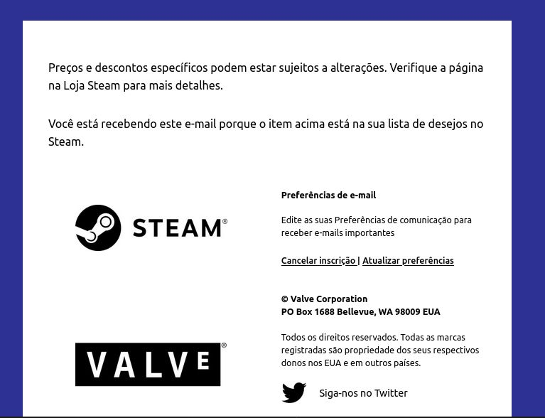

<h1 align="center"> E-mail Steam Ofertas </h1>

 

## 🚀 Tecnologias

Esse projeto foi desenvolvido com as seguintes tecnologias:

- HTML e CSS
- JavaScript
- Tailwindcss

 

 
<h3 align="center">Tela de recriação </h3>

 
  

 

<h3 align="center">Tela de recriação - 2 </h3>

 
  

 

<h3 align="center">Tela de recriação - 3 </h3>

 
  

 

## 💻 Projeto

O projeto é uma cópia do e-mail de **Ofertas de férias**, da empresa **Steam** e foi recriado para treinar as tecnologias utilizadas. O foco também foi a criação de componentes e organização dos mesmos.